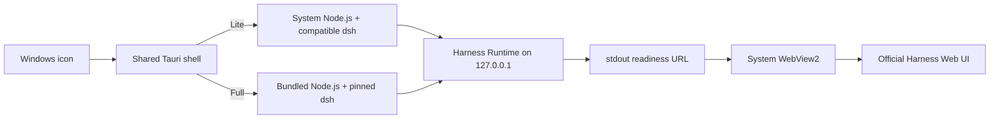

# Architecture

DeepSeek Harness Desktop is a native lifecycle supervisor around the official loopback Web workspace.

## Trust boundaries

- The Runtime binds only to `127.0.0.1` on a persisted high port.
- The shell accepts only the exact `http://127.0.0.1:<port>/` readiness URL emitted after the official plugin tree settles.
- Tauri capabilities apply only to local loading and settings pages. The remote Harness origin receives no desktop IPC commands.
- External links never inherit desktop privileges.
- `DSH_HOME` is isolated under the desktop app data directory. Existing terminal configuration can be imported deliberately later; it is never overwritten implicitly.

## Runtime lifecycle

The process is launched with hidden standard-output and standard-error pipes. This avoids ConPTY startup hangs observed on newer Windows builds while preserving deterministic readiness parsing. A kill-on-close Windows Job Object is the cleanup boundary for the runtime and all descendants. Closing the main window only hides it; choosing **Quit** from the tray terminates the runtime tree.

The official readiness line is treated as the strong startup signal. A bound TCP port alone is insufficient because the web server can bind before the complete plugin tree is ready.

## Stable Origin

The web UI stores some preferences in `localStorage`, which is scoped by origin. The first launch selects an unused high port and persists it. Later launches reuse the port; a new one is selected only when another process already owns it.

## Editions

Lite and Full compile the same Rust and local loading UI. The `full-runtime` Cargo feature changes only Runtime resolution. Full resources are generated into `src-tauri/resources/full-runtime/` during a release build and never committed.
